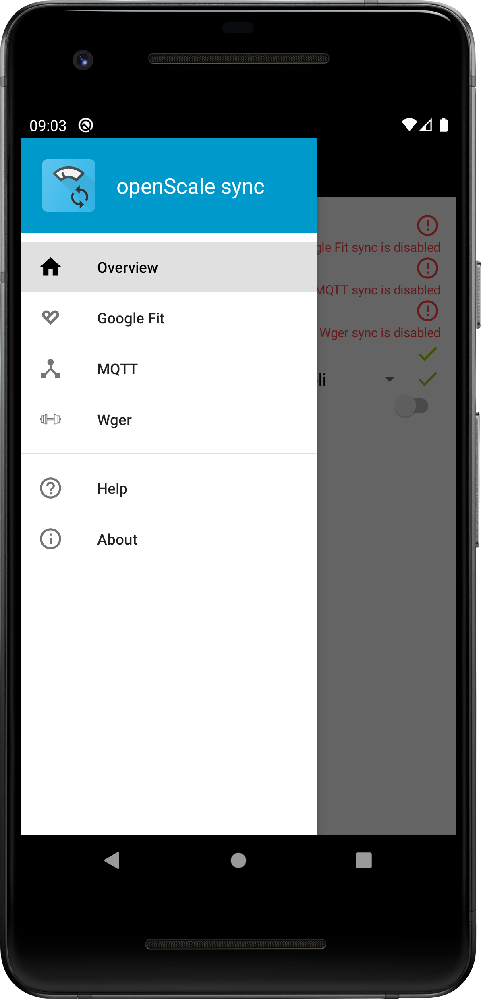
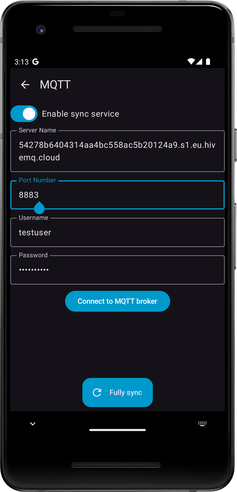
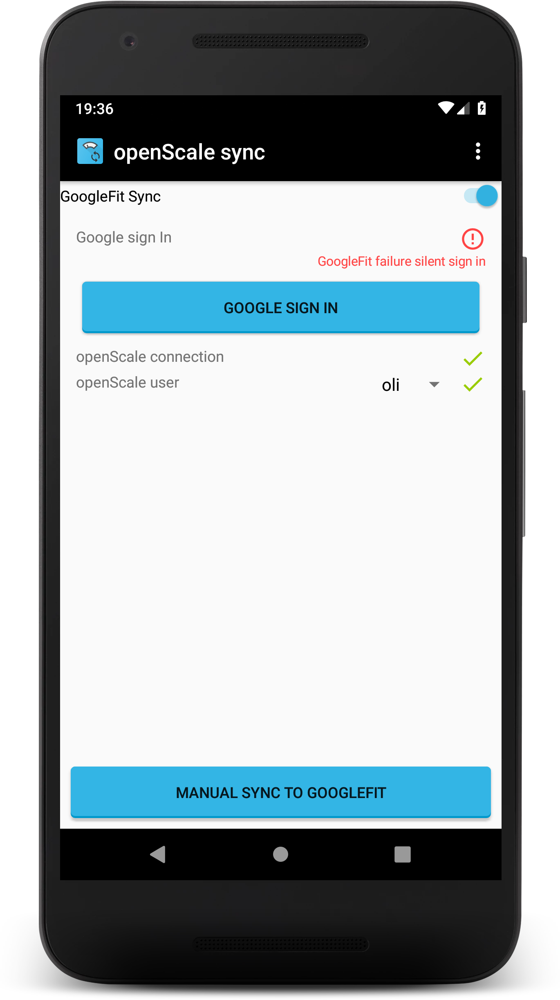

#  openScale sync

Synchronize your openScale measurements with external services

# Summary :clipboard:
* ***Seamless External Service Integration:*** Effortlessly synchronize data with external services like Health Connect, Wger, and MQTT (versions 3.1 and 5.0).
* ***Real-time Synchronization:*** Automatically synchronize data upon insertion, editing, deletion, or clearing of measurements within openScale.
* ***Configurable Service Activation:*** Easily enable or disable individual external services to tailor your synchronization preferences.
* ***On-Demand Full Synchronization:*** Initiate a complete data synchronization manually whenever needed.
* ***Intelligent Foreground Service:*** Utilizes a foreground service that activates only when required, minimizing battery consumption.
* ***User-Specific Synchronization:*** Select the specific openScale user for targeted data synchronization.
* ***Intuitive User Interface:*** Enjoy a user-friendly graphical interface for effortless navigation and control.
  
# Privacy :lock:
This app has no ads and requests no unnecessary permissions. // TODO Link privacy info

# Questions & Issues :thinking:

Before asking, please first read the [openScale sync wiki](https://github.com/oliexdev/openScale-sync/wiki) and try to [find an answer](https://github.com/oliexdev/openScale-sync/issues) in existing issues. If you still haven't found an answer, please create a [new issue](https://github.com/oliexdev/openScale-sync/issues/new/choose) on GitHub.

# Donations :heart:

If you would like to support this project's further development, the creator of this project or the continuous maintenance of this project, feel free to donate via  or become a . Your donation is highly appreciated. Thank you!

# Contributing :+1:

If you found a bug, have an idea how to improve the openScale sync app or have a question, please create new issue or comment existing one. If you would like to contribute code, fork the repository and send a pull request.

# Screenshots :eyes:

<table>
  <tr>
    <th>
        
    </th>
    <th>
        
    </th>
    <th>
        
    </th>
    <th>
        
    </th>
  </tr>
</table>

# License :page_facing_up:

openScale sync is licensed under the GPL v3, see LICENSE file for full notice.

    Copyright (C) 2025  olie.xdev <olie.xdev@googlemail.com>
    
    This program is free software: you can redistribute it and/or modify
    it under the terms of the GNU General Public License as published by
    the Free Software Foundation, either version 3 of the License, or
    (at your option) any later version.

    This program is distributed in the hope that it will be useful,
    but WITHOUT ANY WARRANTY; without even the implied warranty of
    MERCHANTABILITY or FITNESS FOR A PARTICULAR PURPOSE.  See the
    GNU General Public License for more details.

    You should have received a copy of the GNU General Public License
    along with this program.  If not, see <http://www.gnu.org/licenses/>
