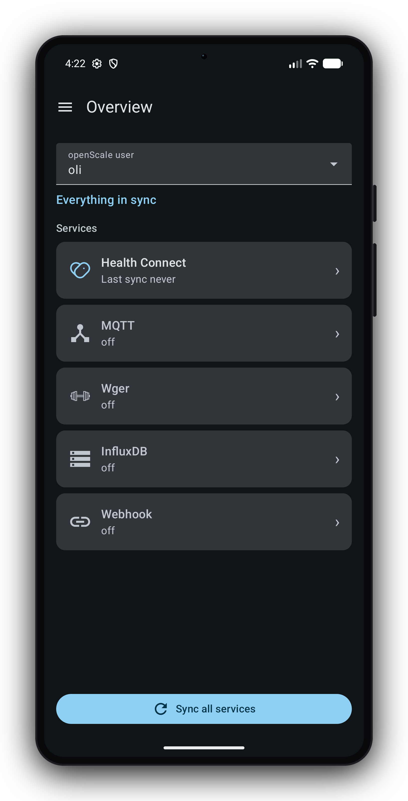
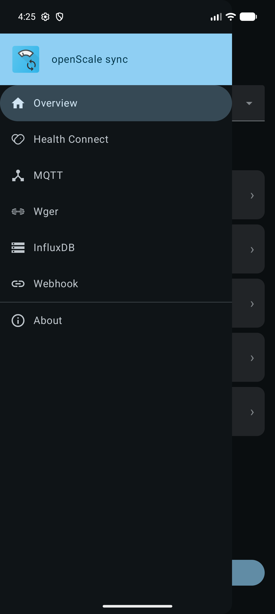
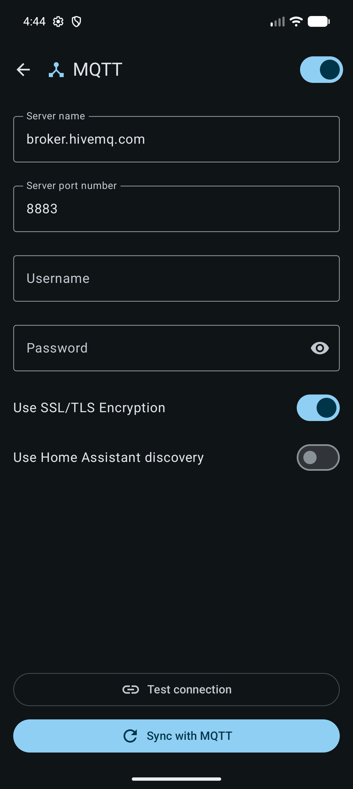
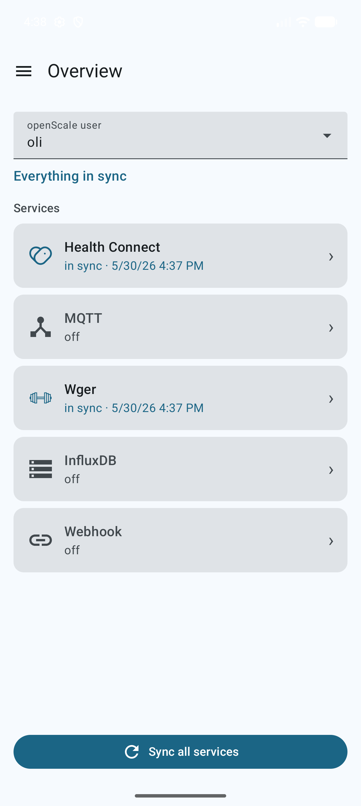

#  openScale sync

Synchronize your openScale measurements with external services

> [!NOTE]
> For the latest development state, install the latest [openScale-sync dev](https://github.com/oliexdev/openScale-sync/releases/tag/dev-build) build from the [GitHub release page](https://github.com/oliexdev/openScale-sync/releases).
> Please be aware that the development version, may contain bugs, and will not receive automatic updates.

> [!IMPORTANT]
> Weight is synced in kilograms (kg). Body fat, muscle mass, and body water are all synced in percent (%). Conversions to other units must be handled by the receiving program.

# Summary :clipboard:
* ***Seamless External Service Integration:*** Effortlessly synchronize data with Health Connect, Wger, Endurain, InfluxDB, generic Webhooks and MQTT (versions 3.1 and 5.0, including Home Assistant discovery).
* ***Real-time Synchronization:*** Automatically synchronize data upon insertion, editing, deletion, or clearing of measurements within openScale.
* ***Two-way Synchronization:*** Measurements that other apps wrote to Health Connect, Wger or MQTT can be imported back into openScale, filling the gaps your scale did not record. Each service has its own direction setting: export only, import only, or both.
* ***Optional Background Synchronization:*** Let the app reconcile everything every few hours, as a safety net for when the instant sync could not run.
* ***On-Demand Full Synchronization:*** Initiate a complete data synchronization manually whenever needed.
* ***Automatic Retry:*** A sync that could not be delivered is retried on its own with the current data, and any measurement still waiting is shown to you.
* ***Multi-User Aware:*** MQTT, InfluxDB and Webhook keep every openScale user separate; Health Connect, Wger and Endurain sync the user you select.
* ***Configurable Service Activation:*** Easily enable or disable individual external services to tailor your synchronization preferences.
* ***Intelligent Foreground Service:*** Utilizes a foreground service that activates only when required, minimizing battery consumption.
* ***Intuitive User Interface:*** Enjoy a user-friendly graphical interface for effortless navigation and control.
  
# Privacy :lock:
This app has no ads and requests no unnecessary permissions, see [privacy policy](https://github.com/oliexdev/openScale-sync/wiki/Privacy-Policy) for more details.

# Questions & Issues :thinking:

Before asking, please first read the [openScale sync wiki](https://github.com/oliexdev/openScale-sync/wiki) and try to [find an answer](https://github.com/oliexdev/openScale-sync/issues) in existing issues. If you still haven't found an answer, please create a [new issue](https://github.com/oliexdev/openScale-sync/issues/new/choose) on GitHub.

# Donations :heart:

If you would like to support this project's further development, the creator of this project or the continuous maintenance of this project, feel free to donate via  or become a . Your donation is highly appreciated. Thank you!

# Contributing :+1:

If you found a bug, have an idea how to improve the openScale sync app or have a question, please create new issue or comment existing one. If you would like to contribute code, fork the repository and send a pull request.

# Screenshots :eyes:

<table>
  <tr>
    <th>
        
    </th>
    <th>
        
    </th>
    <th>
        
    </th>
    <th>
        
    </th>
  </tr>
</table>

# License :page_facing_up:

openScale sync is licensed under the GPL v3, see LICENSE file for full notice.

    Copyright (C) 2025  olie.xdev <olie.xdev@googlemail.com>
    
    This program is free software: you can redistribute it and/or modify
    it under the terms of the GNU General Public License as published by
    the Free Software Foundation, either version 3 of the License, or
    (at your option) any later version.

    This program is distributed in the hope that it will be useful,
    but WITHOUT ANY WARRANTY; without even the implied warranty of
    MERCHANTABILITY or FITNESS FOR A PARTICULAR PURPOSE.  See the
    GNU General Public License for more details.

    You should have received a copy of the GNU General Public License
    along with this program.  If not, see <http://www.gnu.org/licenses/>
